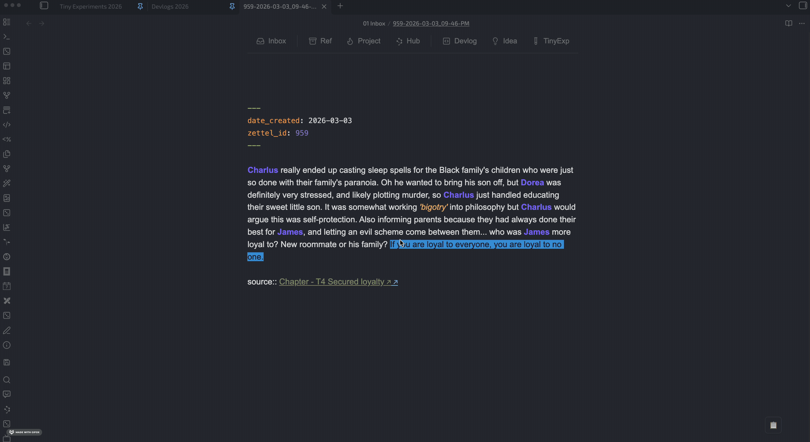

# Vault Linker



Connect your Obsidian vaults together. Link to files and embed content from other vaults as if they were part of your current vault.

## What It Does

Vault Linker lets you work with multiple Obsidian vaults as a unified knowledge base. When you create a link to a note that exists in another connected vault:

- **Clicking the link** opens that file in the other vault
- **Embedding the content** `![[filename]]` displays the remote note inline
- **Cross-vault links** are styled distinctly (customizable colors)

## Features

- **Seamless Cross-Vault Links**: Click `[[Other Note]]` to open it in its native vault
- **Embedded Content**: `![[Remote Note]]` displays the content inline with full markdown rendering
- **Block & Heading References**: Use `#^blockid` or `#Heading Name` to embed specific sections
- **Automatic Vault Discovery**: Scan a folder to find and connect to other vaults
- **Bidirectional Linking**: Connect to vault B, and it automatically suggests vault A to B
- **Custom Styling**: Set link text and embed background colors to match your theme
- **Smart Indexing**: Fast file lookup across all connected vaults with caching

## How It Works

1. **Index Generation**: Each vault generates an `index.json` file listing all its markdown files
2. **Cross-Vault Lookup**: When you open a file, Vault Linker loads indices from all connected vaults
3. **Link Processing**: Unresolved links are checked against the combined index
4. **URI Activation**: Clicking a cross-vault link uses `obsidian://open?vault=...&file=...` to open the file

## Installation

1. Download `main.js`, `manifest.json`, and `styles.css` from the [latest release](https://github.com/Caffa/vault-linker/releases)
2. Place them in `<Vault>/.obsidian/plugins/vault-linker/`
3. Reload Obsidian and enable the plugin in **Settings → Community plugins → Vault Linker**

## Setup

### 1. Configure Vault Connections

Open **Settings → Vault Linker** and set your connections:

**Option A: Auto-Discover Multiple Vaults**

1. Set "Parent folder for vaults" to the folder containing your vaults
2. Click **Scan for Vaults** to find all vaults in that folder
3. Toggle on the vaults you want to connect

**Option B: Add Vaults Individually**

1. Click **Browse & Add** under "Add specific vault"
2. Select a vault folder that has an `.obsidian` folder

### 2. Customize Appearance (Optional)

- Set **Link color** for cross-vault links (default: green)
- Set **Embed background color** for remote embeds (default: light purple)

## Usage

### Linking to Other Vaults

Simply write a link as you normally would. If the file exists in another connected vault, it will be styled as a cross-vault link:

```markdown
Linking to Project A notes:
See [[Project A/Research]] for more details.
```

When clicked, it opens the file in the "Project A" vault.

### Embedding Content

Embed full notes or sections from other vaults:

```markdown
// Embed entire remote note
![[Project A/Research]]

// Embed specific block (using block ID)
![[Project A/Research#^my-block-id]]

// Embed specific section (using heading)
![[Project A/Research#Methodology]]
```

The embedded content is rendered with full markdown support and clicking it opens the source file.

### Refreshing Indices

If you create or rename many files in other vaults, manually refresh:

- Use the command palette: **Refresh Cross-Vault Indices**
- Or reload the current vault to trigger an index rebuild

## Technical Details

- **Desktop Only**: Requires file system access to read indices from other vaults
- **Storage**: Each vault stores its index at `.obsidian/plugins/vault-linker/index.json`
- **Performance**: Uses multiple caches (negative cache, lookup cache, normalization cache) for fast lookups
- **Automatic Updates**: Indices regenerate on file create/delete/rename (debounced 5 seconds)

## Requirements

- Obsidian 1.7.7 or later
- Desktop app (not mobile)
- Other vaults must have Vault Linker installed and enabled

## Limitations

- Links to images in other vaults are not yet supported (use `obsidian://open` URIs manually)
- Only markdown files are indexed
- All vaults must be on the same local filesystem

## Troubleshooting

**Links aren't resolving to other vaults:**

- Verify Vault Linker is installed and enabled in all target vaults
- Check **Settings → Vault Linker → Vault Connections** to ensure vaults are connected (toggle = on)
- Run **Refresh Cross-Vault Indices** from the command palette

**Embed shows no content:**

- Ensure the target file exists in a connected vault
- Check console for errors (Developer Tools → Console)
- Verify the file path is correct (case-sensitive on some systems)

**Can't find other vaults:**

- Set the correct parent folder path in settings
- Click **Scan for Vaults** to rediscover
- Use **Browse & Add** to manually add vault paths

## Contributing

This plugin is open source. Issues and pull requests are welcome on [GitHub](https://github.com/Caffa/vault-linker).

## Support

If you find Vault Linker useful, consider [supporting the project](https://ko-fi.com/pamelawang_mwahacookie).

## License

MIT
